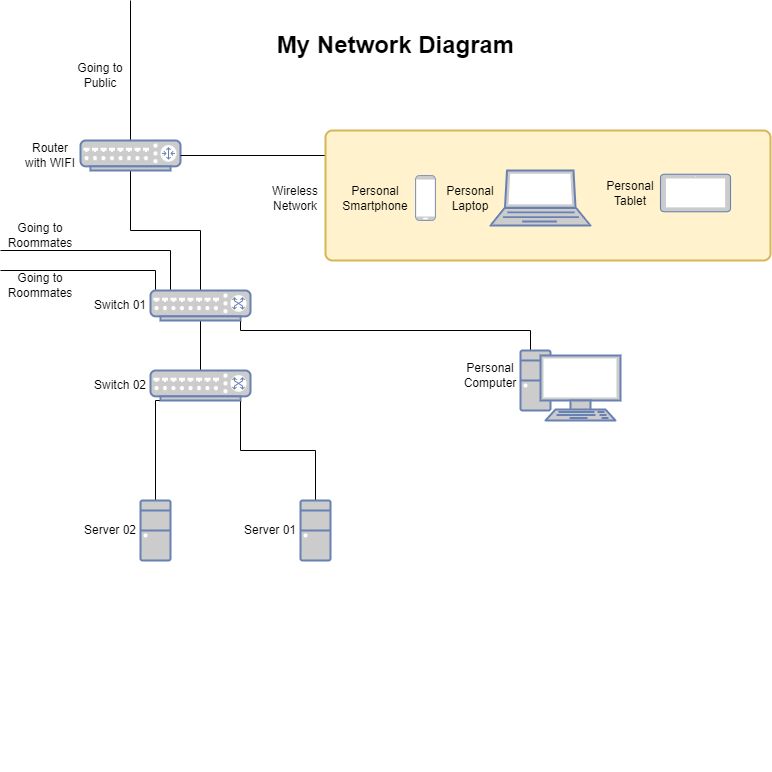

# Home lab Logs

## Purpose

The purpose of the document is to log and show how I use my "Home lab" to learn and expierment with different technologies.  

## Definition of a Home lab
 
To me, the definition of a Home lab is:  

*A sandbox environment built to safely experiment and learn technologies in a "Production" like environment.*  

## Network Diagram

Below is a picture of my current Home lab setup:    
  
